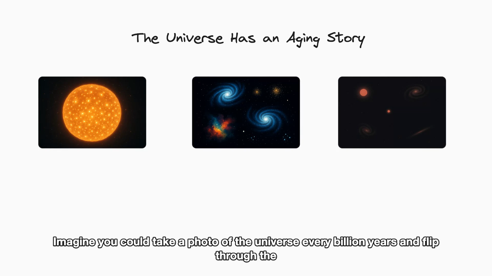

# chalkboard

<p align="center">
  <a href="https://github.com/Atharva-Kanherkar/chalkboard/actions/workflows/ci.yml"></a>
  <a href="./LICENSE"></a>
  <a href="https://github.com/Atharva-Kanherkar/chalkboard/releases"></a>
  = 20">
  
</p>

> Open-source whiteboard-style explainer videos. Prompt → mp4.

`chalkboard` turns a prompt like _"explain how the universe is aging"_ into a
narrated, hand-drawn explainer video — diagrams, real AI-generated imagery,
subtitles, and music — exported as an mp4. It runs entirely on your own machine
and falls back to free local providers (Ollama + Piper TTS), so the marginal
cost per video can be zero. MIT-licensed: yours to fork, embed, and bill for.

<p align="center">
  <a href="https://github.com/Atharva-Kanherkar/chalkboard/releases/download/v0.1.0/chalkboard-demo.mp4">
    
  </a>
</p>

<p align="center">
  <em>▶️ <a href="https://github.com/Atharva-Kanherkar/chalkboard/releases/download/v0.1.0/chalkboard-demo.mp4">Watch the demo</a> — “how the universe is aging”, generated end to end from that single prompt.</em>
</p>

## Features

- **Any provider** — Anthropic, OpenAI, or fully local Ollama for the script; Piper, OpenAI, or ElevenLabs for narration.
- **Hand-drawn diagrams** — a RoughJS sketch aesthetic, with Graphviz auto-layout for graphs, trees, linked lists, and state machines.
- **Real images** — `image` elements are generated with `gpt-image-2` (sharp, accurate in-image text for labels and charts) for visual and science topics (stars, cells, maps), not just boxes and arrows.
- **Vector art** — built-in SVG motifs and custom inline SVG, at zero API cost.
- **Subtitles** — burned into every frame, with no player or libass dependency.
- **Background music** — mood-matched, original CC0 beds (or the real Jamendo catalogue), sidechain-ducked under the narration so the voice stays clear.
- **Self-correcting** — a deterministic layout pass plus an optional vision-model critique that fixes overflow, overlap, and contrast before the final render.
- **$0 local** — Ollama + Piper means zero marginal cost per video; self-host the whole pipeline.

## How it works

```
prompt                  → "explain how the universe is aging"
  llm (any provider)    → SceneScript JSON
  layout repair         → clamp / de-overlap / (optional) vision fix
  image gen             → gpt-image-2 for image elements
  tts (any provider)    → narration per scene
  renderer (Playwright) → canvas video + burned-in captions
  ffmpeg                → narration + ducked music → final mp4
```

Scenes are independent, so the renderer records them in **parallel** browser
contexts and concatenates — render wall-clock tracks the longest scene, not the
sum. Image generation runs concurrently too. Tune with `--render-concurrency`.

## Quickstart

```bash
# 0. system deps
#   - node >= 20.6 (needed for --env-file-if-exists)
#   - pnpm
#   - ffmpeg + ffprobe on PATH
#   - (optional) piper for local TTS

git clone https://github.com/Atharva-Kanherkar/chalkboard
cd chalkboard
pnpm install
pnpm --filter @chalkboard/renderer exec playwright install chromium

# 1. dry-run with stubs (no API keys, no piper)
pnpm --filter chalkboard start generate "explain hash tables" \
  --llm stub --tts stub -o out.mp4

# 2. real run — put your keys in .env at the repo root
cp .env.example .env
# edit .env, then:
pnpm --filter chalkboard start generate "explain hash tables" -o out.mp4
```

Both `apps/server` and `apps/cli` auto-load `.env` from the repo root (and from
their own dir) via Node 20's `--env-file-if-exists`. No `dotenv` dep.

## Project layout

```
packages/
  shared/      types (SceneScript, GenerateOptions, ProgressEvent)
  whiteboard/  pure helpers (draw animation, element normalization)
  llm/         LLMProvider + Anthropic/OpenAI/Ollama/Stub adapters
  narration/   TTSProvider + Piper/OpenAI/ElevenLabs/Stub adapters
  renderer/    Playwright headless Chromium + ffmpeg mux
  core/        generate() orchestrator
apps/
  cli/         `chalkboard generate ...`
  server/      HTTP API: POST /generate, GET /jobs/:id, GET /jobs/:id/video
```

## Configuration

### LLM provider

| kind        | env / setup                                                                                  |
| ----------- | -------------------------------------------------------------------------------------------- |
| `anthropic` | `ANTHROPIC_API_KEY` (default model: `claude-haiku-4-5`)                                      |
| `openai`    | `OPENAI_API_KEY`                                                                             |
| `ollama`    | `OLLAMA_BASE_URL` (default `http://localhost:11434`), `OLLAMA_MODEL` (default `llama3.1:8b`) |
| `stub`      | none — returns a fixed SceneScript, for tests                                                |

Auto-resolution order: `ANTHROPIC_API_KEY` → `OPENAI_API_KEY` → `ollama`.
Force a provider with `--llm <kind>` or `CHALKBOARD_LLM=stub`.

### TTS provider

| kind         | env / setup                                                                 |
| ------------ | --------------------------------------------------------------------------- |
| `piper`      | `piper` on PATH, `PIPER_MODEL` (or `PIPER_MODEL_<LANG>`) to a `.onnx` voice |
| `openai`     | `OPENAI_API_KEY` (default model `tts-1`, voice `alloy`)                     |
| `elevenlabs` | `ELEVENLABS_API_KEY`                                                        |
| `stub`       | none — emits a sine-wave WAV, for tests                                     |

### Subtitles

Captions are **on by default** and drawn straight onto the canvas during render
(bottom-center, white with a dark outline), so they're baked into every frame —
no player support or libass-enabled `ffmpeg` required. They're built from the
narration and timed per scene. Disable with `--no-subtitles` (CLI) or
`"subtitles": false` (HTTP body / `GenerateOptions`).

### Background music

A **mood-matched** music bed is **on by default**, looped under the narration
and **sidechain-ducked** — the music automatically dips whenever the voice is
speaking, so narration stays clearly legible (plus a gentle intro swell and
tail-out fade). The model picks the mood (`meta.mood`) from the subject:

| mood       | feel                                              |
| ---------- | ------------------------------------------------- |
| `wonder`   | lush, optimistic — science / how-it-works (default)|
| `mystery`  | sparse, dark, suspenseful — open questions        |
| `dramatic` | building, cinematic — high stakes                 |
| `upbeat`   | bright, energetic — products / tutorials          |
| `calm`     | soft, slow — meditative explainers                |

Every bundled track is **original and CC0** — layered chord pad + plucked
arpeggio + bass, synthesised with `sox`/`ffmpeg` (regenerate via
`node packages/renderer/scripts/build-music.mjs`).

- Force a mood: `--music-mood mystery` / `"musicMood": "mystery"` (or `none`).
- Use the **real Jamendo catalogue** (Creative Commons): `--music-source jamendo`
  with a free `JAMENDO_CLIENT_ID` — the required attribution is surfaced in the
  output and `result.music.attribution`.
- Bring your own: `--music-track <path>` / `"musicTrack": "<path>"`.
- Disable: `--no-music` / `"music": false`.

### Images

For visual/real-world topics (astronomy, biology, geography…), the model can
emit `image` elements with a `prompt`, and chalkboard generates real imagery for
them with OpenAI's **`gpt-image-2`** (crisp, accurate in-image text for labels,
charts and diagrams) and draws it (cover-fit, rounded corners) into the box.
Needs `OPENAI_API_KEY`; **each image costs money**, so generation
is cached per prompt and capped per video. Disable with `--no-images` /
`"images": false` (image elements then render as neutral placeholders). Override
the model with `--image-model <id>`.

Control cost with `--image-quality low|medium|high|auto` (default **`medium`** —
roughly 4× cheaper than `high`/`auto`). Each run reports its estimated image
spend from the API's token usage, e.g. `[image] generated 7 image(s) — ~$0.42 (est.)`.

### Self-correcting render

Because rendering isn't live, chalkboard can look at what it drew and fix it
before finalizing. Two layers:

1. **Deterministic repair** (always on) — clamps overflow, de-dupes stacked
   text, separates overlaps. No API calls.
2. **Vision critique** (opt-in: `--self-correct [passes]` / `"selfCorrect": true|N`)
   — screenshots each scene's final state, sends the still to a vision model
   (`gpt-4o` by default, `OPENAI_VISION_MODEL` to override), and applies the
   corrected elements it returns. Catches what geometry can't: unreadable
   contrast, text over a dark shape, awkward composition. Bounded passes; needs
   `OPENAI_API_KEY`.

### Vector art (SVG + motifs)

Beyond the hand-drawn shapes, the model can emit `svg` elements for crisp vector
art at **zero API cost**:

- `{ type: "svg", motif: "star", color: "#f08c00", x, y, width, height }` — a
  built-in icon by name (`star`, `bolt`, `heart`, `check`, `cross`, `sun`,
  `cloud`, `gear`, `lightbulb`, `database`, `arrow-right`).
- `{ type: "svg", svg: "<svg>…</svg>", … }` — any custom inline SVG, drawn
  contained (never cropped) in the box.

Both motifs and inline SVG are pure-vector and add nothing to your API bill.

## Usage

### CLI

```bash
# Render a video
chalkboard generate "explain pointers" \
  --lang en --aspect 16:9 \
  --llm anthropic --tts piper \
  -o pointers.mp4

# Just dump the SceneScript JSON (no render — useful for prompt iteration)
chalkboard script "explain pointers" --llm anthropic > script.json
```

Run `chalkboard --help` for the full flag list.

### Library

```ts
import { generate } from '@chalkboard/core';

await generate({
  prompt: 'explain hash tables',
  outputPath: './hash-tables.mp4',
  language: 'en',
  aspectRatio: '16:9',
  llm: { kind: 'anthropic' },
  tts: { kind: 'piper' },
  onProgress: (e) => console.log(e),
});
```

### HTTP service + web UI

```bash
pnpm --filter @chalkboard/server start
# → chalkboard server listening on http://0.0.0.0:4140
```

Open <http://localhost:4140> in a browser for the prompt → mp4 web UI.
The same port also serves the HTTP API:

```bash
curl -X POST http://localhost:4140/generate \
  -H 'content-type: application/json' \
  -d '{
    "prompt": "explain pointers",
    "llm": { "kind": "anthropic" },
    "tts": { "kind": "piper" }
  }'
# → { "jobId": "...", "status": "running" }

curl http://localhost:4140/jobs/$ID            # poll
curl http://localhost:4140/jobs/$ID/video -o out.mp4
```

Configure: `STORAGE_DIR` (default `./out`), `PORT` (default 4140).
API keys are read from the server's env; the web UI never sees them.

### Studio (Next.js web app)

`apps/studio` is the polished product frontend: a chat-style workspace where you
type a topic, watch the pipeline run live (script → narration → render → mux),
and get the mp4 inline with a download. Toggle aspect ratio, subtitles, music,
images, self-correct, or **⚡ Demo** (stub providers — instant, no API cost).

```bash
pnpm --filter @chalkboard/server start            # backend on :4140
pnpm --filter @chalkboard/studio dev              # studio on :3000
```

Open <http://localhost:3000>. The studio proxies `/api/*` to the server
(`CHALKBOARD_API` env overrides the target), so it deploys independently of the
backend. Two lanes are live — **Explainer** (16:9) and **Reels** (vertical 9:16
shorts); Repurpose is on the roadmap.

### Reels (vertical shorts)

The Reels lane (or `--short` on the CLI) switches to a hook-first vertical
preset: 9:16, 3-5 tight scenes, one punchy sentence each, large captions lifted
clear of the platform UI, royalty-free music. Music is intentionally
royalty-free — Instagram/TikTok's trending songs are licensed for in-app use
only, so add them after posting rather than baking copyrighted audio into the
export.

```bash
chalkboard generate "3 wild facts about black holes" --short -o reel.mp4
```

### SceneScript

The contract between LLM and renderer is a typed JSON document:

```jsonc
{
  "version": "1",
  "meta": { "language": "en", "aspectRatio": "16:9", "title": "Hash Tables" },
  "scenes": [
    {
      "id": "scene-1",
      "narration": "A hash table maps keys to values...",
      "elements": [
        {
          "id": "s1-rect",
          "type": "rectangle",
          "x": 200,
          "y": 200,
          "width": 400,
          "height": 80,
          "strokeColor": "#1e1e1e",
          "backgroundColor": "#a5d8ff",
          "fillStyle": "solid",
        },
        {
          "id": "s1-text",
          "type": "text",
          "x": 220,
          "y": 220,
          "text": "hash(key)",
          "fontSize": 32,
          "fontFamily": 1,
        },
      ],
    },
  ],
}
```

Element types: `rectangle`, `ellipse`, `diamond`, `line`, `arrow`, `text`,
`code-block`, `step-marker`, `group`, `highlight`, `graphviz`, `image`, `svg`.
Elements appear progressively (opacity ramp, staggered) while the narration
plays; visual timing stretches to match audio.

## Smoke tests

```bash
# Pure-logic tests (parse, timing, normalize, draw)
pnpm test

# Renderer smoke (hardcoded SceneScript → mp4) — ~10 sec
pnpm --filter @chalkboard/renderer smoke

# Full pipeline smoke (stub LLM + stub TTS → mp4) — ~6 sec
pnpm --filter @chalkboard/core smoke
```

## Cost per video

| Setup                              | Cost per video |
| ---------------------------------- | -------------- |
| Ollama + Piper (fully local)       | $0             |
| Claude Haiku + Piper               | ~$0.0002       |
| Claude Haiku + OpenAI TTS          | ~$0.002        |
| Cloud LLM + TTS + generated images | ~$0.10–2.00    |

Generated images dominate the cloud cost — cap or disable them (`--no-images`)
to stay in fractions of a cent. Rendering is real-time: a 90-second video takes
a few minutes of wall-clock as Playwright records the canvas, in exchange for
portability and no render farm.

## Roadmap

- **Faster rendering** — offscreen, frame-by-frame capture to cut a render from minutes to seconds (today it records the canvas in real time).
- **Animated vector art** — MIT-licensed Lottie playback composited into the render, alongside the static SVG/motifs.
- **Document ingestion** — turn a PDF or Markdown doc into a video, not just a prompt.
- **More voices & languages** — broaden the local (Piper) voice library.

## License

[MIT](./LICENSE)
